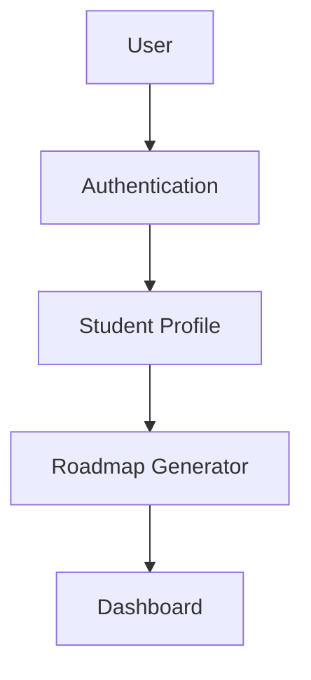

# CampusCompass


> An AI-powered platform designed to help students discover career paths, generate personalized learning roadmaps, and track their academic and professional growth.

---

## Features

* 🔐 User Authentication
* 👤 Student Profiles
* 🧠 AI-Powered Roadmap Generation
* 📚 Personalized Study Planner
* 📊 Progress Tracking Dashboard
* 🎯 Career Guidance System
* 📅 Calendar Integration (Upcoming)
* 📄 Resume Analysis (Upcoming)

---

## 📸 Screenshots

### Landing Page

*Coming Soon*

### Dashboard

*Coming Soon*

### Student Profile

*Coming Soon*

### Roadmap Generator

*Coming Soon*

> Screenshots will be added as the project evolves.

---

## 🛠️ Tech Stack

### Frontend

* React.js
* Tailwind CSS

### Backend

* Node.js
* Express.js

### Database

* MongoDB

### Authentication

* JWT Authentication

### Other Tools

* Git & GitHub
* REST APIs

---

## ⚙️ Installation

### Clone the repository

```bash
git clone https://github.com/arpit2006/CampusCompass.git
cd CampusCompass
```

### Install dependencies

```bash
npm install
```

### Start the development server

```bash
npm run dev
```

### Build for production

```bash
npm run build
```

---

## 📁 Project Structure

```text
CampusCompass
│
├── client/
├── server/
├── public/
├── src/
├── docs/
└── README.md
```

---

## 🏗️ Architecture Overview

```text
User
  ↓
Authentication
  ↓
Student Profile
  ↓
Roadmap Generator
  ↓
Dashboard
```

### System Flow



---

## 🚀 Live Demo

Production deployment is currently under development.

* Production URL: Coming Soon
* Preview URL: Coming Soon

---

## 🤝 Contributing

We welcome contributions from everyone!

### Steps to contribute

1. Fork the repository
2. Clone your fork
3. Create a new branch

```bash
git checkout -b feature/your-feature
```

4. Make your changes.
5. Commit your changes.

```bash
git commit -m "feat: add your feature"
```

6. Push the branch.

```bash
git push origin feature/your-feature
```

7. Open a Pull Request.

Please read the `CONTRIBUTING.md` file before submitting a PR.

---

## 🗺️ Project Roadmap

### Phase 1

* [ ] Personalized Study Planner
* [ ] Resume Analyzer
* [ ] Course Recommendation Engine
* [ ] Progress Analytics
* [ ] Calendar Integration

### Phase 2

* [ ] AI Career Assistant
* [ ] Interview Preparation Module
* [ ] Learning Analytics Dashboard
* [ ] Skill Gap Analysis
* [ ] Internship Recommendation System

### Phase 3

* [ ] Community Features
* [ ] Peer Learning Groups
* [ ] Mentor Matching
* [ ] Mobile Application

---

## 🌟 Open Source Programs

CampusCompass aims to actively participate in:

* GSSoC (GirlScript Summer of Code)
* Hacktoberfest
* Beginner-Friendly Open Source Programs

New contributors are always welcome!

---

## ❓ FAQ

### What is CampusCompass?

CampusCompass is an AI-powered platform that helps students build personalized career and learning roadmaps.

### Who can contribute?

Anyone interested in open source can contribute.

### Is AI used in this project?

Yes. AI is used to generate personalized recommendations and roadmaps.

### How are roadmaps generated?

Roadmaps are generated using user preferences, goals, and selected career paths.

### Is this project beginner-friendly?

Absolutely! We encourage first-time contributors to participate.

---

## 👨‍💻 Maintainers

### Arpit Shirbhate 

* GitHub: @arpit2006

Contributors are welcome to reach out through GitHub discussions and issues.

---

## 📜 License

This project is licensed under the MIT License.

See the `LICENSE` file for more information.

---

## ⭐ Support the Project

If you find this project useful:

🌟 Star the repository

🍴 Fork the repository

🤝 Contribute to the project

Together, let's make career guidance more accessible for students.
