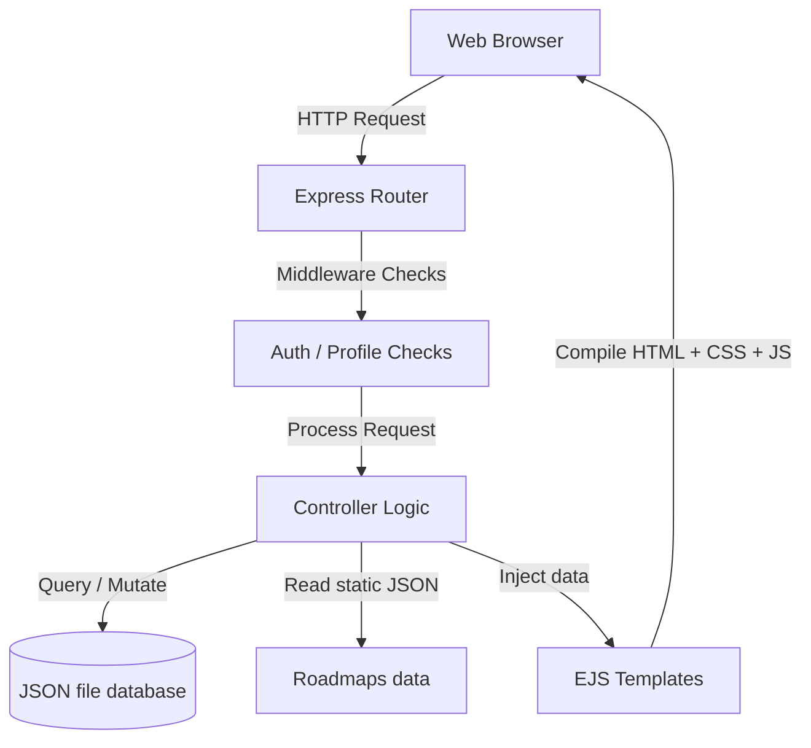

# 🏗️ CampusCompass System Architecture

This document describes the architectural layout, data structures, and request flows of the CampusCompass Phase 1 implementation. It serves as a guide for contributors to understand how different components interact.

---

## 🗺️ Architectural Overview

CampusCompass is built as a monolithic web application using the **MVC (Model-View-Controller)** pattern. This keeps the separation of concerns clear and simple for beginners to contribute to.



1. **Client**: Renders HTML/CSS templates, handles basic UI interactions (mobile menu toggle, FAQ accordions), and sends HTTP requests.
2. **Express Router**: Receives HTTP request calls and routes them to specific controller functions.
3. **Middleware**: Enforces access rules:
   - Blocks guest users from seeing private dashboards.
   - Redirects uncompleted profiles to the onboarding setup page.
   - Binds global session status variables (`isLoggedIn`) to the client environment.
4. **Controllers**: Houses the main business logic (validating inputs, calculating roadmap progress, reading files, and resolving database queries).
5. **Models**: Defines the user data structure and file persistence layer (reading/writing to the `data/users.json` file).
6. **Views**: Serves pre-compiled HTML layouts.

---

## 🗄️ Database Schema Design

For Phase 1, all authentication data and student credentials are saved in a unified `data/users.json` file. This prevents external server dependencies and keeps data persistence simple and offline-capable.

### User Object Map

```json
{
  "_id": "String (Unique Timestamp)",
  "email": "String (Required, Unique, Lowercase)",
  "password": "String (Hashed via bcryptjs)",
  "isProfileComplete": "Boolean (Default: false)",
  "profile": {
    "fullName": "String (Default: '')",
    "collegeName": "String (Default: '')",
    "branch": "String (Default: '')",
    "currentYear": "String (Default: '')",
    "cgpa": "Number (Default: null)",
    "careerGoal": "String (Default: '')",
    "skills": "Array of Strings (Default: [])",
    "interests": "Array of Strings (Default: [])",
    "dailyStudyHours": "Number (Default: null)"
  },
  "createdAt": "ISODate",
  "updatedAt": "ISODate"
}
```

- **Password Hashing**: Done automatically in the `User.save()` method using `bcryptjs` (salt factor 10).
- **Profile Completion Flag**: Controls routing: if `false`, users are redirected back to the setup onboarding screen.

---

## 🛣️ Middleware & Routing Pipeline

The routing pipeline uses session validation cookies (`express-session`) to check user login status. 

### 1. Registration & Authentication Flow
- User registers (`POST /register`). The password is encrypted, user document is saved, and `req.session.userId` is initialized.
- User is automatically redirected to `/profile/setup` since `isProfileComplete` is `false`.

### 2. Dashboard Rendering & Progress Math
When a student requests `/dashboard`:
1. `ensureProfileComplete` middleware checks if `req.session.userId` exists and if the user's profile is populated.
2. The controller loads the career path roadmap JSON file matching the student's selected career (e.g., `web-developer.json`).
3. The controller parses the student's `skills` array.
4. The controller runs a matching function comparing student skills with the roadmap's topics.
5. Topics containing words matching user skills are marked as `isCompleted: true`.
6. Completion percentage is calculated: `(completedTopicsCount / totalTopicsCount) * 100`.
7. EJS compiles the timeline cards and renders the dashboard.

---

## 📂 File System Layout & Modularity

- `app.js`: System bootstrap, middleware setup, database boot, and server execution.
- `/config/db.js`: Logs details of the active local JSON database path.
- `/data/roadmaps/`: Holds static JSON structures for standard career roles.
- `/routes/`: Translates URI endpoints into actions.
- `/controllers/`: Controls application flow.
- `/views/partials/`: Layout components to avoid code duplication across templates.
- `/public/`: Public-facing styling and interactive JS files.
